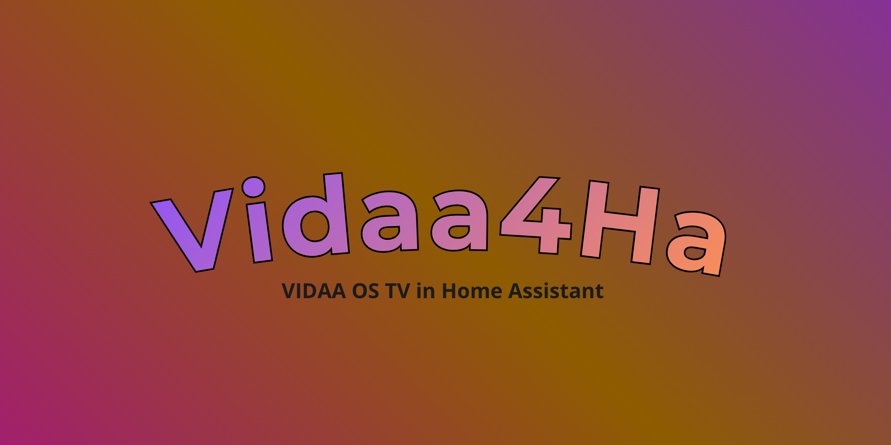
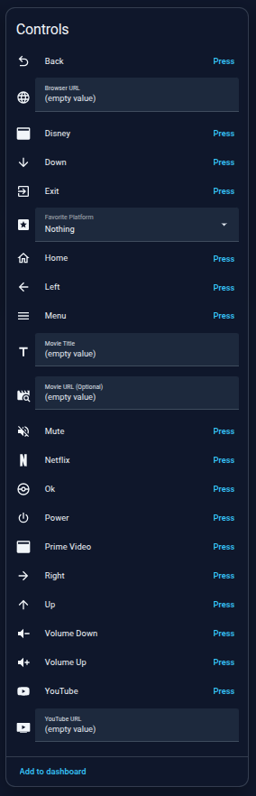
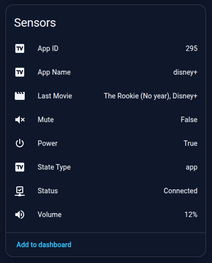
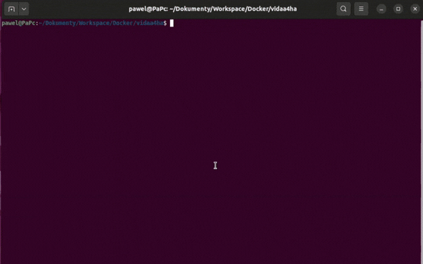

# Vidaa4Ha
Control your VIDAA OS TV directly from Home Assistant!



## Features
* Automatically creates Home Assistant entities using MQTT Discovery. 
* You can control your TV in almost everything.
* Gives you access to all buttons available on the TV remote.
* Lets you play movies and TV shows from  Netflix, Disney+ and Prime Video via the appropriate url (or by title, but it requires from you a streaming-availability API key from [rapidapi.com](https://rapidapi.com/) - there is also an entity, where you can choose your favorite platform).  
* Lets you open any URL in the TV's built-in web browser.
* Lets you open any YouTube video directly on your TV.
## Installation
### Docker Compose:
1. Create a folder **'vidaa4ha'**.
2. Create a file named **'docker-compose.yml'** in this folder and write:
```
services:
  vidaa4ha:
    image: ghcr.io/pawelisme/vidaa4ha:latest
    container_name: "vidaa4ha"
    restart: unless-stopped
    volumes:
      - ./config.yaml:/app/config.yaml:ro
      - ./certs:/root/.config/pyvidaa/certs:ro
```
3. Create a file named **'config.yaml'** and write [this](#configuration)
4. Create a folder named **'certs'** and add the client TLS certificates extracted from the VIDAA app. These certificates are required for communication with the TV. See the full guide [here](#obtaining-the-client-certificate) for detailed instructions on how to obtain them.
5. Open terminal in main folder and type:
```
docker compose up -d
```
6. Check logs by typing:
```
docker logs -f vidaa4ha
```


## Configuration
Complete example of **'config.yaml'**:

```
mqtt:
  host: <your_mqtt_broker>        # Required -> The IP of your mqtt broker
  port: 1883                      # Required -> Port of your mqtt broker (most often 1883)
  username: <your_username>       # Required, if login_required: true
  password: <your_password>       # Required, if login_required: true
  login_required: true            # Optional -> Default: false
  discovery_prefix: homeassistant # Optional -> Default: 'homeassistatnt'

tv:
  host: <tv_ip>                   # Required -> The IP of your tv
  mac_address: <tv_mac_Address>   # Required -> The mac address of ur tv
  port: 36669                     # Required -> You have to specify (most often 36669 for vidaa)
  name: 'Your TV Name'            # Optional -> Default: 'Vidaa TV'
  brand: 'TV Brand'               # Oprional -> Default: 'No brand'
  model: 'TV Model'               # Optional -> Default: 'No model'


# Optional, but you give up entities like Movie Title and Favorite Platform (Auto searching by free API - streaming-availability)
rapidapi:
  key: "Your Rapidapi Key"
```

## Obtaining the client certificate

Modern Vidaa TVs require **client TLS certificates** — you must have a certificate and
private key that are built into the official Vidaa Mobile App **('vidaa_client.pem' and 'vidaa_client.key')**. For legal reasons
**vidaa4ha does not share this certificates**, so you have to supply your own copy of them (older TVs may connect without it, but probably its required).


## Gallery
### Homeassistant entities:
 
 

### Container logs:


## License
Vidaa4Ha is released under the MIT License - see [LICENSE](LICENSE) for details.
